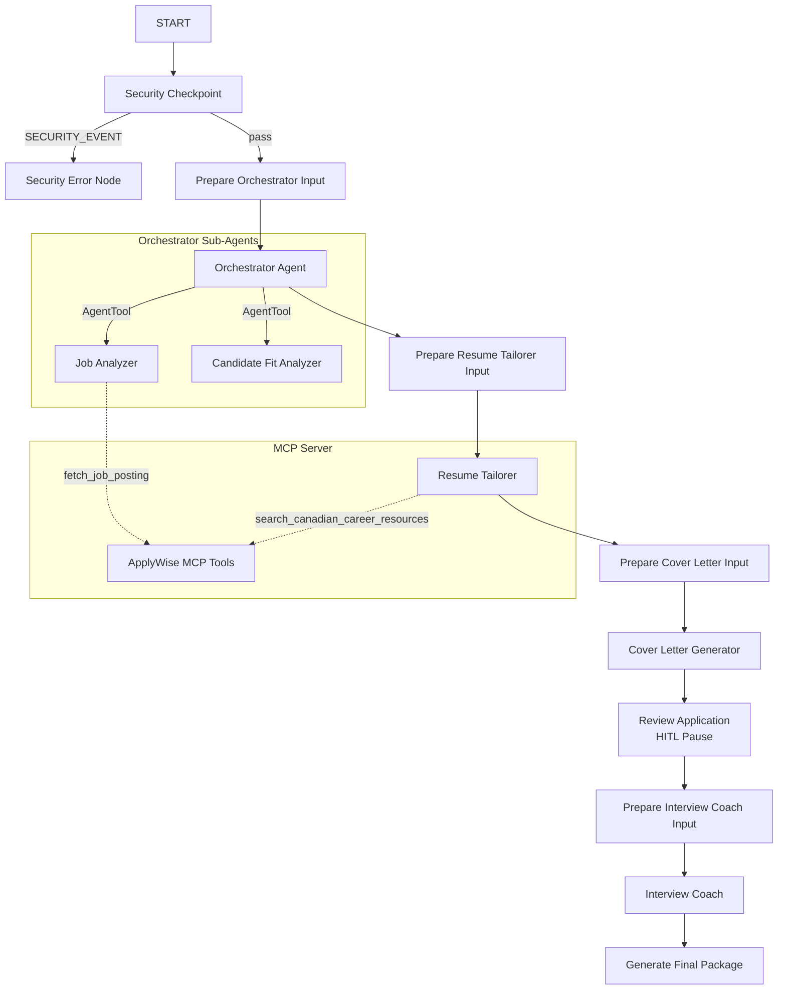

# ApplyWise AI — Project Submission Write-Up

## Problem Statement
Job seekers targeting the Canadian tech market face unique challenges:
1. **Resume Regulations**: Canadian anti-discrimination laws strictly prohibit including personal information like photos, age, gender, marital status, or Social Insurance Numbers (SIN) on resumes.
2. **Bilingual Requirements**: Many Canadian roles, particularly in the public sector or in regions like Quebec, require bilingual (English/French) proficiency, necessitating tailored assets in both languages.
3. **Application Tailoring**: Job seekers struggle to map their skills effectively against complex job postings, leading to generic applications that fail automated screening (ATS) or recruiter reviews.

ApplyWise AI solves this by acting as a secure, bilingual career concierge that analyzes job postings, assesses candidate fit, tailors resumes to Canadian standards, drafts cover letters, and provides interview preparation and bilingual elevator pitches.

---

## Solution Architecture

The agent uses a structured multi-agent workflow to coordinate analysis, editing, and coaching.

---

## Concepts Used

The project leverages several core features of the Google Agent Development Kit (ADK) 2.0:

1. **ADK Workflow (Graph API)**: The entire application is structured as a directed graph in [app/agent.py](file:///c:/Users/epier/Documents/AIAgents/adk-workspace/applywise_ai/app/agent.py#L408-L442). It defines nodes for security, orchestration, editing, human-in-the-loop validation, and coaching.
2. **LlmAgent**: Multiple specialized agents are defined in [app/agent.py](file:///c:/Users/epier/Documents/AIAgents/adk-workspace/applywise_ai/app/agent.py#L99-L174) (e.g., `job_analyzer`, `candidate_fit_analyzer`, `resume_tailorer`, `cover_letter_generator`, `interview_coach`), each with distinct instructions and output schemas.
3. **AgentTool**: The `orchestrator` agent in [app/agent.py](file:///c:/Users/epier/Documents/AIAgents/adk-workspace/applywise_ai/app/agent.py#L124-L134) uses `AgentTool` to delegate tasks to `job_analyzer` and `candidate_fit_analyzer` as tools.
4. **MCP Server (Model Context Protocol)**: An independent MCP server is implemented in [app/mcp_server.py](file:///c:/Users/epier/Documents/AIAgents/adk-workspace/applywise_ai/app/mcp_server.py) using the FastMCP SDK. It is wired into the agents via `McpToolset` in [app/agent.py](file:///c:/Users/epier/Documents/AIAgents/adk-workspace/applywise_ai/app/agent.py#L77-L93).
5. **Human-in-the-Loop (HITL)**: A `RequestInput` event is utilized in [app/agent.py](file:///c:/Users/epier/Documents/AIAgents/adk-workspace/applywise_ai/app/agent.py#L292-L308) to pause execution, allowing the user to review the drafted cover letter and resume before generating interview prep materials.
6. **Agents CLI**: The project was scaffolded, tested, and run using the `agents-cli` toolset.

---

## Security Design

To protect user data and maintain application integrity, the workflow begins with a `security_checkpoint` node in [app/agent.py](file:///c:/Users/epier/Documents/AIAgents/adk-workspace/applywise_ai/app/agent.py#L177-L232):

* **PII Scrubbing**: Regex filters detect and redact sensitive personal information such as Social Insurance Numbers (SIN), email addresses, and phone numbers. This prevents accidental leakage of sensitive identifiers to external LLMs.
* **Prompt Injection Mitigation**: A keyword detection system checks inputs for adversarial phrases (e.g., "ignore all previous instructions", "system override"). If detected, the workflow routes to a `security_error_node` and aborts.
* **Structured Audit Logging**: Every security decision is logged in a structured JSON format (containing severity levels like `INFO`, `WARNING`, `CRITICAL`), providing a clear audit trail.

---

## MCP Server Design

The MCP server in [app/mcp_server.py](file:///c:/Users/epier/Documents/AIAgents/adk-workspace/applywise_ai/app/mcp_server.py) exposes four domain-specific tools:

1. **`fetch_job_posting`**: Scrapes and cleans job descriptions from web URLs, stripping HTML tags to optimize token usage.
2. **`search_canadian_career_resources`**: Provides localized context on Canadian resume lengths, anti-discrimination laws, salary ranges, and bilingualism.
3. **`read_local_resume`**: Reads local resume files in `.txt` or `.md` format.
4. **`save_application_package`**: Safely writes the final tailored application package to the local disk.

---

## Human-in-the-Loop (HITL) Flow

Applying for jobs requires high precision. To ensure the candidate has full control, the workflow uses a `review_application` node:
* After the `resume_tailorer` and `cover_letter_generator` finish their work, the workflow pauses.
* It sends the drafted assets to the user and waits for a `RequestInput` response.
* The user can approve the drafts or provide feedback. Once approved, the workflow proceeds to the `interview_coach` node to compile the final package.

---

## Demo Walkthrough

The following three scenarios demonstrate the workflow's versatility:

1. **Bilingual Match**: A candidate with Python and FastAPI experience matches a Junior AI Engineer role. The agent extracts requirements, scores the fit, tailors the resume, and drafts a cover letter. During the HITL phase, the user approves, and the agent generates a custom prep package including a 30-second elevator pitch in both English and French.
2. **PII Protection**: If a user submits a resume containing their SIN (e.g., `123-456-789`), the security checkpoint redacts it to `[REDACTED_SIN]` before processing, keeping the user's identity secure.
3. **Injection Defense**: If a user tries to hijack the agent via prompt injection (e.g., "ignore previous instructions"), the checkpoint flags it, logs a `WARNING`, and exits with a secure error message.

---

## Impact & Value Statement

ApplyWise AI empowers tech professionals by:
* **Saving Time**: Automating the tedious process of resume and cover letter tailoring.
* **Ensuring Compliance**: Keeping resumes compliant with Canadian hiring regulations (eliminating PII risks).
* **Boosting Confidence**: Providing bilingual interview coaching tailored to the candidate's specific skill gaps.
* **Enhancing Quality**: Delivering high-quality, targeted application packages that stand out to Canadian recruiters.
